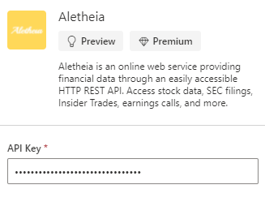
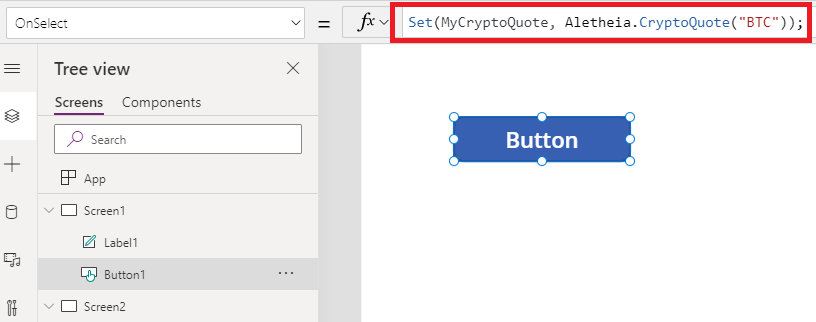
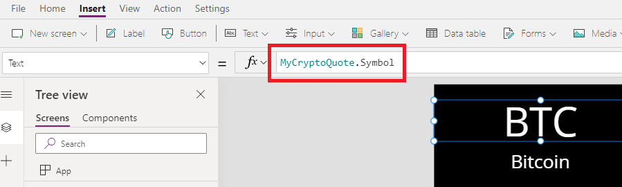
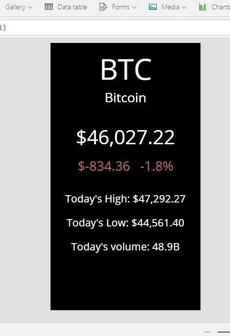
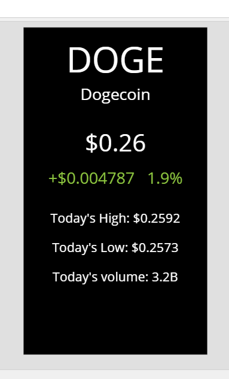

# Crypto Quotes Now Available in Power Apps & Power Automate via the Aletheia Connector
This week, the Power Platform (Microsoft Power Apps and Power Automate) added the out-of-the-box capability of retrieving prices and day trading data for cryptocurrencies. You can now get quotes and live market data for your favorite coins like Bitcoin, Ethereum, and Dogecoin!

## Use the Aletheia Connector
The Aletheia API service is available for free use in the Power Platform via the [official connector](https://docs.microsoft.com/en-us/connectors/aletheia/). In the sample below, we are selecting it in Power Apps:

## Provide your Aletheia API Key
Register for an account with Aletheia (free) at https://aletheiaapi.com/login to get an API key that you will use with Power Apps/Automate to begin using the service.

## Use Aletheia's "CryptoQuote" Action to Request a Crypto Quote
Provide the symbol of cryptocurrency to the **CryptoQuote** action. In this example we are providing it via a string value, but you can also reference the content of a text input so, for example, a user would be able to dynamically change it.

Examples of symbols you can request:
- BTC - Bitcoin
- ETH - Ethereum
- DOGE - Dogecoin
- LTC - Litecoin
- XRP
- SHIB - Shiba Inu Coin

The above list is in no way exhaustive. There are plenty more you can request data for!

## Reference the Quote Properties in the App/Flow
The formula above saved the quote data to an object variable named "MyCryptoQuote". To reference the data in the quote elsewhere in the app, do it as such:

*Please note that the price of every cryptocurrency is in US Dollars*

## Use all of the Data!
Aletheia provides us with plenty of contextual data about the cryptocurrency we are requesting data for. Access the price, today's high and low, the year high and low, today's volume, and more.

Example with Bitcoin ("BTC"):

Example with Dogecoin ("DOGE"):

## Get Started!
Visit Aletheia's [login page](https://aletheiaapi.com/login) to start pulling crypto quotes in Power Apps and Power Automate for free!
