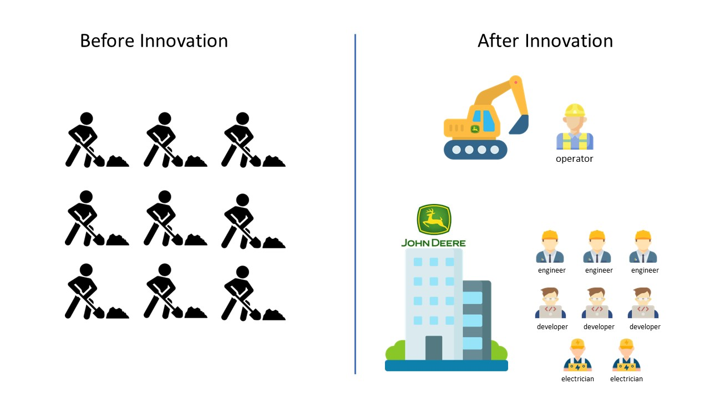

# Will AI Take My Job?

*Yes, but it won't leave you jobless.*

In three short months, it's made multiple headlines in every major news outlet, has sourced hundreds of billions of dollars in investment from the world's leading technology companies, and is making millions of working professionals across every industry apprehensive about their career. The rise of Artificial Intelligence in 2023, spearheaded by OpenAI's ChatGPT, has been difficult to miss and one question is on the minds of many: *will it replace me?* In this article I will offer my thoughts and perspectives.

## Replacing Human Effort
We must face the music. There are many areas in which various AI solutions *are already* competing with human skill:
- Image generation models [DALL-E 2](https://openai.com/product/dall-e-2) and [Stable Diffusion](https://en.wikipedia.org/wiki/Stable_Diffusion) are now alternatives to artists, animators, and graphic designers.
- Instead of paying $250 per hour for IT support, one can quickly troubleshoot an IT issue they are having by asking [Bing AI](https://blogs.microsoft.com/blog/2023/02/07/reinventing-search-with-a-new-ai-powered-microsoft-bing-and-edge-your-copilot-for-the-web/).
- [ChatGPT](https://openai.com/blog/chatgpt) can help you think through the pros and cons of any organizational strategy decision, taking this responsibility from the highly expensive "big four" consulting firms who previously held this post for decades.
- [ChatGPT](https://openai.com/blog/chatgpt) can write a fictional novel for you on any subject of your choosing, competing with authors known for their work.
- While [ChatGPT](https://openai.com/blog/chatgpt) is not a *journalist*, it allows anyone to easily play the role of a journalist by easily generating quality content on demand, commoditizing the skills of a journalist.

And we could keep going. There are countless ways in which this technology is *already* making us rethink our approach across every industry today.

## Will I be left jobless?
To answer this question, let's look back in time. 

Before the invention of modern machinery in construction, groups of men used to dig holes manually with shovels, often working long hours in harsh conditions. This backbreaking work was physically demanding and would take a toll on their bodies, resulting in injuries and chronic pain. The repetitive motion of digging with a shovel could lead to back problems, joint pain, and other health issues. The work was often performed in extreme temperatures, such as under the scorching sun or in freezing temperatures, which could also have negative health consequences.

The first backhoe, an excavating machine for digging holes, was invented in 1948. 

When the backhoe was first introduced, many were concerned that it would replace the jobs of these manual laborers who used shovels and other hand tools to dig. Many people worried that the use of machines like the backhoe would lead to mass unemployment and a loss of valuable skills. 

We now understand these concerns to be **preposterous**. It quickly became clear that the backhoe could perform the job far faster, far more efficiently, would save the workers from bodily injury, and would cost significantly less while doing so. 

The near-sighted perspective would be to focus on the immediate loss of man hours: what once required a group of nine manual laborers six hours now requires a single backhoe operator 30 minutes. 

The reality of the situation is *no jobs were lost*; the jobs shifted to higher-skilled talent. Instead of nine men with shovels, we now have engineers, developers, electricians, and more that *develop* the backhoe, and a single skilled *operator* of the backhoe machine at the site.

The backhoe is only one example. We've seen this throughout history time and time again:
- The invention of the digital computer was a concern for the jobs of those in the paper industry. With things going digital, there would be less of a need for paper. What was originally a threat to their existence has now become their biggest growth engine: the paper manufacturers of yesterday have now pivoted their business model to manufacturing and supplying Amazon, a *digital* retailer, with the 1,600,000 million cardboard boxes it uses for deliveries each day.
- The invention of the car put horse trainers, coachman, farriers, stablehands, and buggy developers out of business (not entirely as this is still a novelty) but the explosion in job opportunities in the modern-day car industry more than compensates.
- Alarm clock manufacturers, landline phone manufacturers, GPS device manufacturers, all feared for their jobs when the smartphone was introduced to the world in the late 2010's. The explosive growth in the number of jobs and major companies spawned from the smartphone alone is difficult to comprehend. From games, to peripheral devices, and more... even enormous companies like Uber and Lyft have a business model pinned on the fact that everyone has a small computer in their pocket!

## The Future is Already Unfolding
Despite seeing this pattern repeatedly through history, it is difficult to predict how each major innovation will mature in today's world. However, we're already seeing glimpses of the future with AI unfold in front of us:
- Several universities have already put together new curriculum focused on effectively using AI tools; they call it [prompt engineering](https://fourweekmba.com/prompt-engineering/).
- Sam Altman, the CEO of OpenAI, is [investing heavily in a startup attempting to add 10 healthy years to every human lifespan using AI](https://www.technologyreview.com/2023/03/08/1069523/sam-altman-investment-180-million-retro-biosciences-longevity-death/).
- Tech giants are rushing to incorporate these AI models into their existing products: [Microsoft is boosting conversational value of their Power Virtual Agents chat bot](https://powervirtualagents.microsoft.com/en-us/blog/optimize-your-chatbots-with-new-ai-features-for-power-virtual-agents/), [Google is enhancing their flagship search service with Bard, their own LLM](https://blog.google/technology/ai/bard-google-ai-search-updates/), and [Salesforce is introducing Einstein GPT to assist customers with various CRM tasks](https://www.youtube.com/watch?v=YAsKRxXdyj0&ab_channel=Salesforce).
- Large language models, like what powers ChatGPT, will soon be coupled with both telephony services and realistic voice generators and will completely reimagine the modern-day call center. What was once a facility of 2,000 call center reps will become a small group of ten managers that handle escalations from a bot's 25,000 conversations in a day.

## New Horizons, Previously Unimagined
Like we've seen from previous disruptive innovations, the advent of AI will also open doors for even more innovation that was previously unimaginable. Old and new companies alike now have new tools at their disposal which will revolutionize what they can build and accomplish. Using these tools, many companies will form and build products that we never thought would be possible before:
- By training an AI model on all text you ever wrote, every message you ever sent, every picture that was ever taken of you, and anything you've ever said, our friends and relatives will be able to chat with a version of us by asking a bot to impersonate us. The bot will nearly perfectly be able to simulate us by impersonating our speech habits, likeliness, memories, humor, and more. Once AI image generation is strong enough, our loved ones will be able to chat and reminisce with a version of us, after our death, over a video call with the AI generating every frame of video and audio based on it's understanding of what we look and sound like.
- Our entertainment will be generated *on demand*. Want to watch a movie about a team of explorers that encounter hardship while traveling through the cosmos in search of alien life? Give this prompt to an AI; the movie will be generated for you as you pop your popcorn.
- There will be massive improvements to the mental health of the population with the democratization of highly effective counseling and therapy at low cost. AI chatbots will be paired with cutting edge text-to-speech capabilities that will be fine-tuned specifically to sound and feel like a real human that cares for the well-being of its user. In many cases, these bots will be more effective than most human therapists as they will be trained on millions upon millions of successful and unsuccessful examples of interactions between a therapist and their client. These bots will meticulously use each training example to "learn" which response is most effective in any part of a conversation. I hope we see a significant decline in the number of suicides and opioid addictions as a result.
- Roleplaying Games (RPG's) and franchises like Skyrim, Elden Ring, and Star Wars will provide richer experiences to gamers. In the past, developers had to tediously hand-design each conversation you would have with each resident of a city; you'd select from a series of options with each character at every turn of the conversation. With Large Language Models like GPT-3, you can ask an AI bot to impersonate any character from any time period and allow the user to speak to the character freely. Virtual cities will feel *real*.
- In the short term, AI helps me be a better developer. In the long term, AI will *alleviate* the need for me to develop. In the future, we will describe the app that we want and allow the AI to build the complete code repository for us. Want a new feature? Describe the feature to the AI model and allow it to create the code, commit directly to your Git repo, design and perform unit tests, and deploy.

## The Bottom Line
Will AI take your job? There is a good chance it will. But at least for the foreseeable future, it will *not* leave you jobless. Just like how we saw the backhoe take the jobs of diggers with shovels, the net effect was not *fewer jobs* across the economy. These jobs moved "up the stack", with highly skilled workers now *developing* backhoe machinery and *supporting* the company that developed the machinery. 

The bottom line is this: **as long as you are willing to continue to learn, adapt, and re-skill, you will not be left jobless**. Practice a growth mindset, embrace change, and ride the technology wave to new heights!